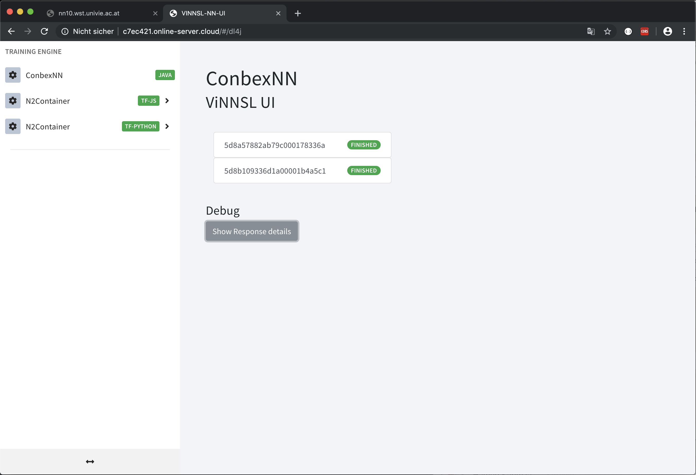
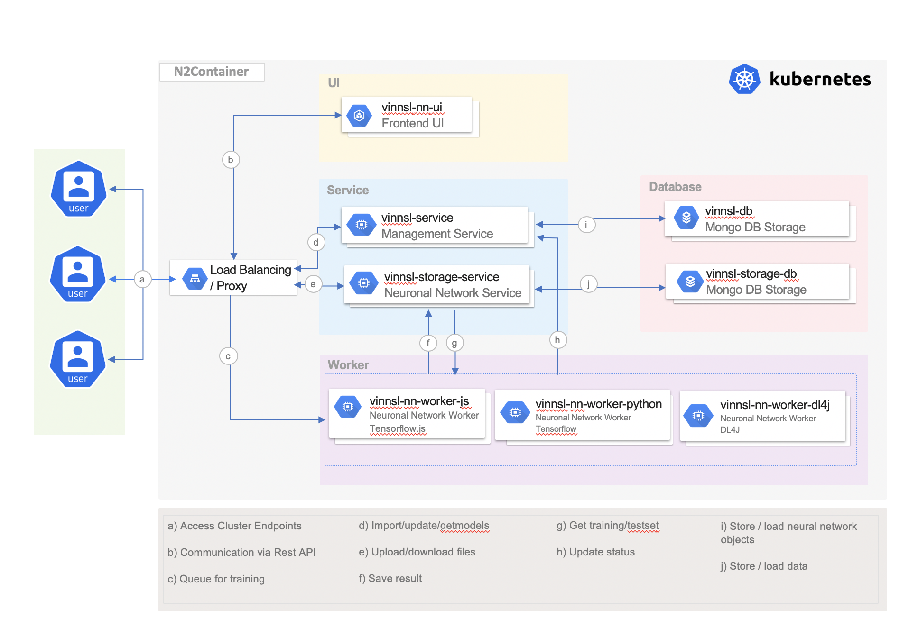
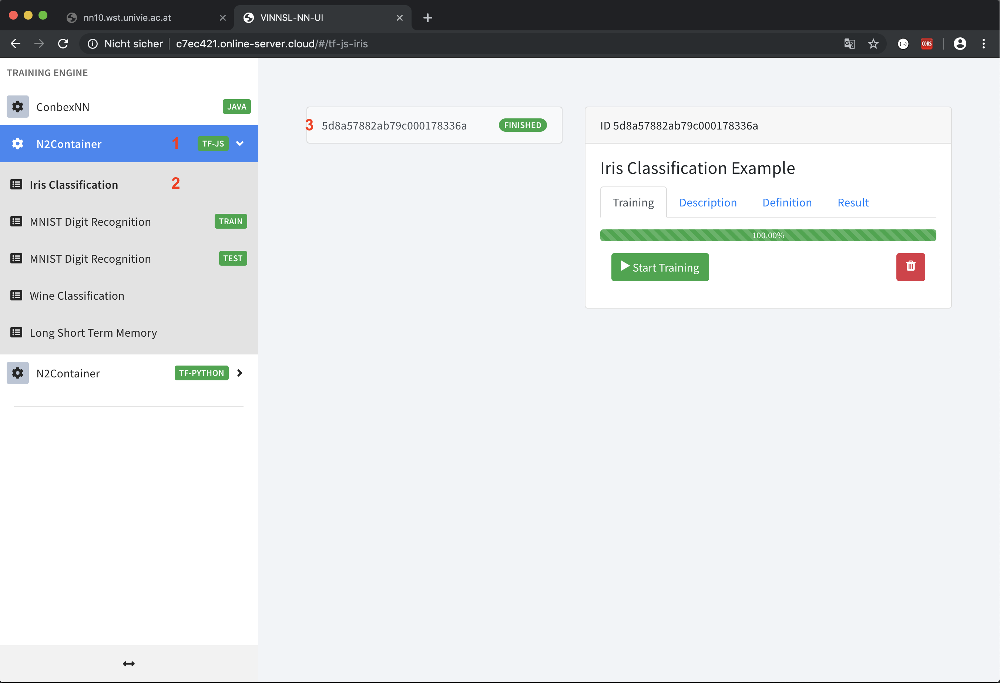
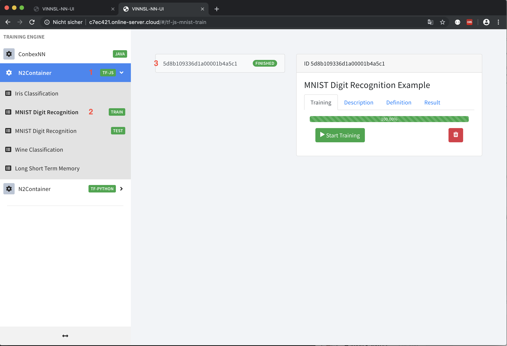
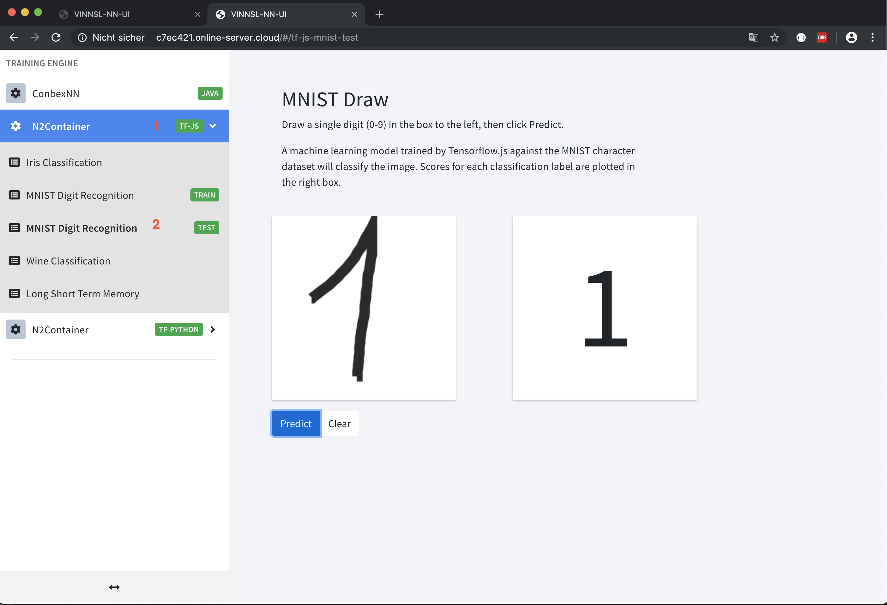
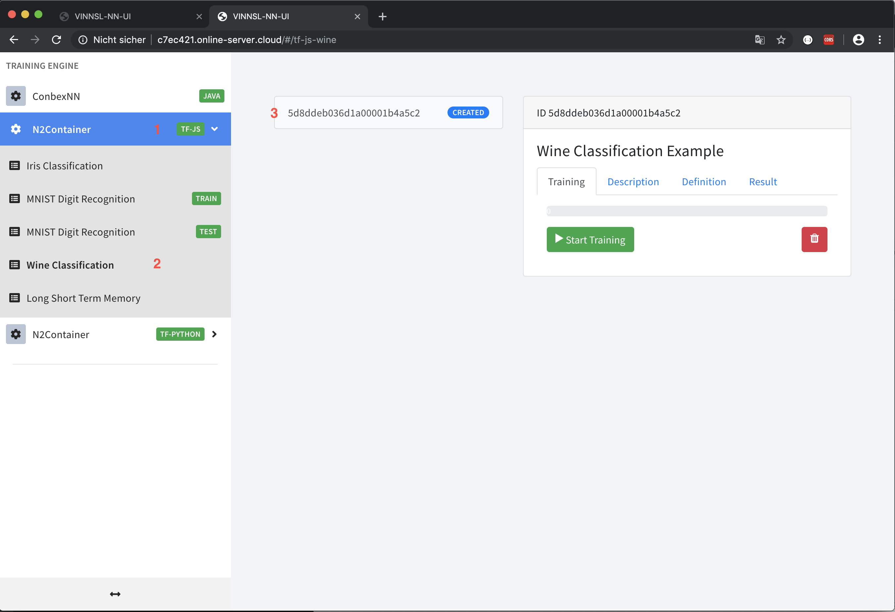
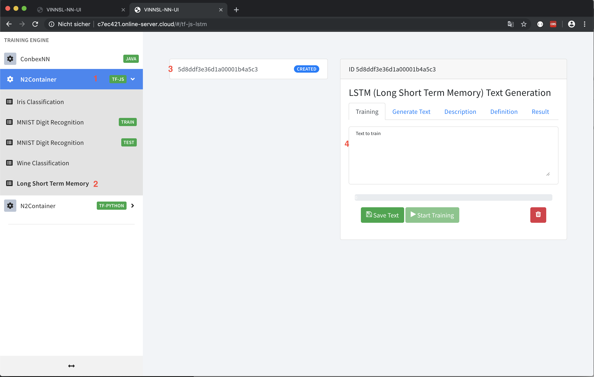

# N2Container
This project presents N2Container
using the Kubernetes container orchestration, TensorFlow.js (node.js), TensorFlow (python)
and a Java based microservice architecture,
which is exposed to users and other systems via RESTful webservices. 
This work is influenced by container based execution stack for neural networks (ConbexNN).
The whole workflow
including importing, training and evaluating a neural network model, becomes
possible by using this service oriented approach. The execution stack runs
on many common cloud platforms. Furthermore it is scalable and each component is
extensible and interchangeable.
## Graphical User Interface

# Architecture

## Worker
### Java
*description will be created*
### TensorFlow.js (Node.js)
TensorFlow.js is a JavaScript Library for training and deploying machine learning models in the browser and in Node.js.

### TensorFlow (Python)
*description will be created*

## Usage
### Preconditions
* Postman installed
* Neural network created/exist
* ViNNSL definition created/exist

If not, follow instructions [here](https://github.com/MatthiasS3/N2Container#postman{:target="_blank"})
### ConbexNN - Java
*description will be created*
### N2Container - TensorFlow.js
The following section explain how to use neuronal networks.

#### Iris Classification

1. Click on N2Container on menu bar
2. Click on Iris Classification on menu bar
3. Choose a network, if not exist follow instructions [here](https://github.com/MatthiasS3/N2Container#postman{:target="_blank"}) 
4. Start training

#### MNIST Digit Recognition (TRAIN)

1. Click on N2Container on menu bar
2. Click on MNIST Digit Recognition on menu bar
3. Choose a network, if not exist follow instructions [here](https://github.com/MatthiasS3/N2Container#postman{:target="_blank"}) 
4. Start training

#### MNIST Digit Recognition (TEST)

Draw a single digit (0-9) in the box to the left, then click Predict.

#### WINE Classification

1. Click on N2Container on menu bar
2. Click on Wine Classification on menu bar
3. Choose a network, if not exist follow instructions [here](https://github.com/MatthiasS3/N2Container#postman{:target="_blank"}) 
4. Start training

#### Long Shot Term Memory (Text generation)

1. Click on N2Container on menu bar
2. Click on Long Short Term Memory on menu bar
3. Choose a network, if not exist follow instructions [here](https://github.com/MatthiasS3/N2Container#postman{:target="_blank"}) 
4. Insert a long text (you can insert any languages)
5. Save text
6. Start training

Optional:
Precondition: model is trained.
This tab will be unlocked after training is finished.
1. Open the "Generate Text" tab to generate a text. (can take 10-20 seconds)

### N2Container - TensorFlow
#### Iris Classification

#### MNIST Digit Recognition (TRAIN)

#### MNIST Digit Recognition (TEST)

#### WINE Classification

#### Long Shot Term Memory (Text generation)

